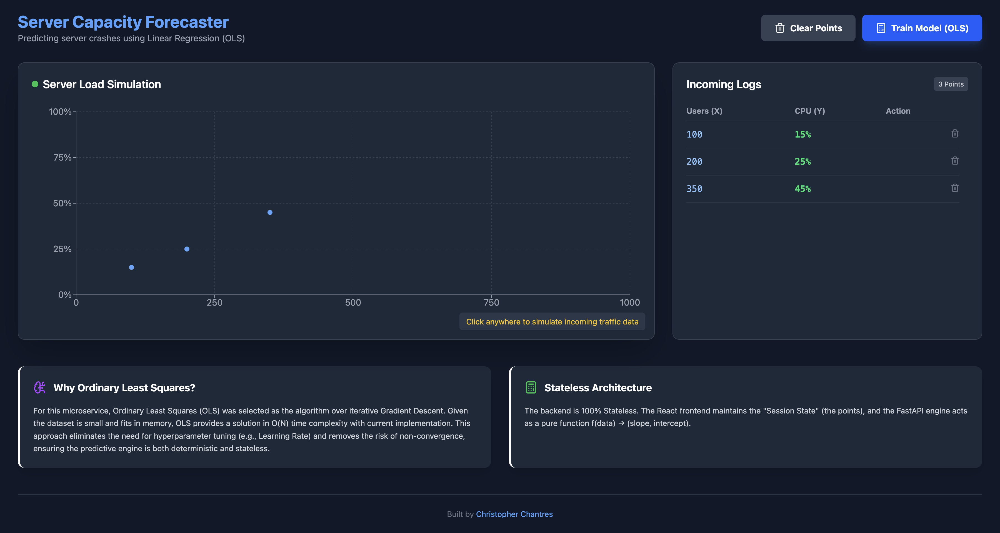

# Server Capacity Forecaster

<!-- Add your project screenshot below -->

<!-- Or use a hosted image:  -->

A full-stack application that predicts server CPU usage based on user traffic using **Ordinary Least Squares (OLS)** linear regression.

> ⚡ **Built from scratch** – The OLS regression algorithm is implemented manually using only NumPy, without relying on machine learning libraries like scikit-learn.

## Features

- 📊 **Interactive Scatter Chart** – Click to add data points simulating server traffic logs
- 🧠 **OLS Linear Regression** – Hand-coded prediction engine with instant training (no sklearn)
- 🗑️ **Data Management** – Add, delete, or clear all data points
- 🐳 **Dockerized** – Full containerized setup with hot-reload for development

## Tech Stack

| Layer     | Technology                     |
|-----------|--------------------------------|
| Frontend  | React, Vite, Tailwind CSS, Recharts |
| Backend   | FastAPI, NumPy, Pydantic       |
| Infra     | Docker, Docker Compose         |

## Getting Started

### Prerequisites

- Docker & Docker Compose installed

### Run the Application

```bash
docker-compose up --build
```

- **Frontend**: http://localhost:3000
- **Backend API**: http://localhost:8000

## Architecture

```
┌─────────────────┐       POST /train       ┌─────────────────┐
│                 │  ───────────────────▶   │                 │
│  React Frontend │                         │  FastAPI Engine │
│  (State: points)│  ◀───────────────────   │  (Stateless OLS)│
│                 │   {slope, intercept}    │                 │
└─────────────────┘                         └─────────────────┘
```

The frontend maintains session state (data points), while the backend acts as a pure function `f(data) → (slope, intercept)`, enabling horizontal scalability.

## Project Structure

```
server-capacity-forecaster/
├── backend/
│   ├── app/
│   │   ├── engine.py      # OLS regression implementation
│   │   ├── main.py        # FastAPI routes & CORS
│   │   └── schemas.py     # Pydantic models
│   ├── Dockerfile
│   └── requirements.txt
├── frontend/
│   ├── src/
│   │   ├── components/    # React components
│   │   └── services/      # API client
│   ├── Dockerfile
│   └── package.json
└── docker-compose.yml
```